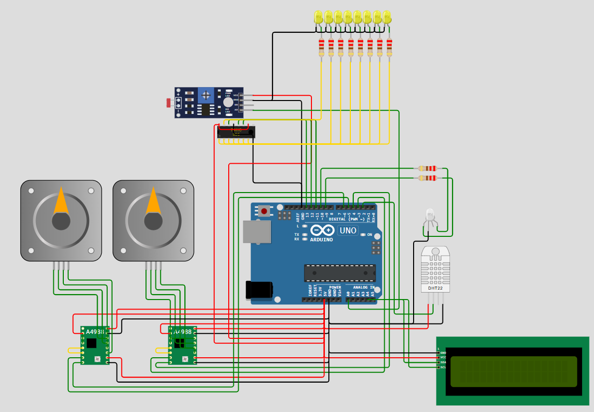

# Sistema de control y actuación en función del clima
## Descripción del sistema

Sistema enfocado en una boya oceanográfica que tomará medidas de la temperatura y la humedad del aire.
Dispone de un sistema para controlar la temperatura de las baterias de tal forma que si estan muy calientes se abrirá una trampilla que permita el paso de aire para refrigerarlas. En caso de que la temperatura sea muy fría se activarán las resistencias para mantener una temperatura óptima para el funcionamiento de las baterias.
También dispone de un sensor LDR que se utiliza para ajustar la cantidad de leds que deben estar encendidos.

---

## Estructura del hardware

| Componente             | Descripción                                                       | Conexiones Arduino                          |
|------------------------|-------------------------------------------------------------------|---------------------------------------------|
| Arduino Uno            | Microcontrolador principal                                        | Fuente de alimentación y pines digitales    |
| DHT22                  | Sensor de temperatura y humedad                                   | Pin digital 2                               |
| LCD 16x2 con I2C       | Display para visualización de datos                               | SDA (A4), SCL (A5)                          |
| Driver A4988 (x2)      | Controlador de motores paso a paso                                | STEP (3 y 5), DIR (4 y 6), VMOT, GND, VDD   |
| Motores paso a paso    | Actuadores para válvulas de frío y calor                          | Conectados a los drivers A4988              |
| LED RGB Azul           | Indica activación de la válvula de frío                           | Pin 10 (con resistencia de 220Ω)            |
| LED RGB Rojo           | Indica activación de la válvula de calor                          | Pin 9 (con resistencia de 220Ω)             |
| 74HC595                | Registro de desplazamiento para controlar múltiples LEDs          | Pines digitales (11, 12, 13)             |
| 8 LEDs Amarillos       | Indican niveles de iluminación ambiental                          | Salida del 74HC595 (con resistencias)       |
| Fotoresistor (LDR)     | Sensor de luz ambiental                                           | Conectado a entrada analógica (A0)      |
| Resistencias (220Ω)    | Limitación de corriente para LEDs y control de señal              | En serie con LEDs                           |


---

## Organización de archivos

- **MotorPaso.h / MotorPaso.cpp**  
  Control de los motores de frío y calor:
  - Inicialización de pines y aceleración
  - Conversión de PWM a ángulo
  - Movimiento del motor con aceleración
  - Control de LEDs según actividad

- **ControlTemperatura.h / ControlTemperatura.cpp**  
  Lógica de control:
  - Lectura del sensor DHT22
  - Control proporcional por temperatura
  - Aplicación de zona muerta
  - Simulación térmica interna

- **ControlIluminacion.h / ControlIluminacion.cpp**  
  Lógica y control del sistema de iluminación:
  - Lectura del sensor LDR para medir la luz ambiental (lux)
  - Cálculo del porcentaje de iluminación ambiente respecto al objetivo
  - Control escalonado de LEDs mediante registro de desplazamiento (shift register)
  - Visualización de datos de iluminación en pantalla LCD

- **sketch.ino**  
  - Inicialización general
  - Ciclo principal de ejecución
  - Llamadas a funciones de control y actuación


---

## Algoritmo de control para la temperatura

El objetivo principal de este sistema es mantener la temperatura ambiente cercana a un setpoint definido mediante un control discontinuo de tres posiciones con zona muerta. El sistema regula la apertura de válvulas de frío y calor mediante motores paso a paso, controlados proporcionalmente en base a la diferencia térmica. Se evita el sobrecontrol mediante una zona muerta configurable.


### Descripción del sistema

Este proyecto implementa un sistema de control térmico automático que mantiene la temperatura ambiente cerca de un valor de consigna. Se utilizan motores paso a paso para abrir o cerrar válvulas de frío y calor, un sensor DHT22 para lectura de temperatura y un algoritmo de **control discontinuo de tres posiciones con zona muerta**.

---

### Lógica general del algoritmo desarrollado

#### 1. Lectura del sensor

- Cada 1 s se lee la temperatura ambiente con el sensor DHT22.
- Si la lectura es válida, se actualiza la temperatura medida `T_m`.
- Si falla, se emplea la temperatura interna simulada del sistema.
---

#### 2. Control con zona muerta

Se define:
- $` T_s `$ emperatura de consigna
- $`\Delta `$: semiancho de zona muerta
- $'T_m \`$: temperatura medida

El comportamiento del control se describe así:

$$
\text{Zona muerta} = [T_s - \Delta,\quad T_s + \Delta]
$$

- Si $`( T_m < T_s - \Delta ) `$ → Activar calor:
  
  $`PWM_{calor} = \text{constrain}(k \cdot (T_s - \Delta - T_m),\ 0,\ 255) `$

- Si $`( T_m > T_s + \Delta ) `$ → Activar frío:
  
  $`PWM_{frio} = \text{constrain}(k \cdot (T_m - T_s - \Delta),\ 0,\ 255) `$

- Si $`( T_m \in [T_s - \Delta,\ T_s + \Delta] )`$ → No hacer nada:
  
  $`PWM_{calor} = PWM_{frio} = 0 `$

Donde $` k  `$ es una constante de ganancia proporcional (ej. 20.0).

---

#### 3. Conversión de PWM a ángulo

La señal PWM (0-255) se transforma en ángulo para la válvula:

$$
\theta = \frac{PWM}{255} \cdot 359^\circ
$$

---

#### 4. Conversión de ángulo a pasos de motor

Con $` \text{stepsPerRev} = 3200 `$ pasos/rev (1.8° con 1/16 microstepping):

$$
\text{pasos} = \left( \frac{\theta}{359} \right) \cdot \text{stepsPerRev}
$$

---

#### 5. Movimiento de motores

- Cada motor se mueve usando el método `stepper.run()` de la librería **AccelStepper**.
- Se aplica aceleración para evitar movimientos bruscos.

---

#### 6. Indicadores LED

- LED RGB Azul (pin 10): se enciende si $` PWM_{frio} > 0 `$
- LED RGB Rojo (pin 9): se enciende si $` PWM_{calor} > 0 `$

---

#### 7. Simulación térmica del sistema

Para validar el sistema sin hardware físico, se simula una planta térmica:

$$
\Delta T_{calor} = 0.5 \cdot \frac{PWM_{calor}}{255}
$$

$$
\Delta T_{frio} = 0.5 \cdot \frac{PWM_{frio}}{255}
$$

Influencia del ambiente:

$$
\Delta T_{ambiente} = 0.005 \cdot (T_{amb} - T_{sistema})
$$

Actualización de la temperatura interna simulada:

$$
T_{sistema}(t+1) = T_{sistema}(t) + \Delta T_{calor} - \Delta T_{frio} + \Delta T_{ambiente}
$$

---
### Lógica de ejecución del sistema. Resumen

1. Se lee la temperatura ambiente con el DHT22.
2. Si la lectura falla, se mantiene el valor anterior.
3. Se calcula la diferencia con el setpoint y se aplica el control de 3 posiciones.
4. Se generan las señales PWM para frío y calor.
5. Cada PWM se convierte en ángulo y luego en pasos de motor.
6. Se mueven los motores con aceleración.
7. Se actualizan los LEDs según los PWM.
8. Se simula el efecto térmico de las válvulas y del ambiente.

---
### Ejemplo práctico del control de temperatura

En esta imagen real se puede observar la válvula de calor abierta y el LED RGB encendido en color rojo, indicando que el sistema está activando la calefacción para mantener la temperatura deseada.


---

## Algoritmo de Control de Iluminación con LDR y Registro de Desplazamiento

Este sistema controla la iluminación artificial mediante 8 LEDs conectados a un registro de desplazamiento **74HC595**, en función de la luz ambiente medida por un sensor **LDR**. El objetivo es mantener la iluminación total próxima al 80% del valor máximo deseado.

---

### Objetivo del sistema

Asegurar que la **iluminación total** (natural + artificial) se mantenga cerca de un valor de referencia (`luxObjetivo = 60000 lux`), utilizando **control proporcional inverso**.

---

### Funcionamiento general

#### 1. Medición de iluminación con LDR

Se obtiene la iluminancia en lux a partir del valor analógico del LDR:

```cpp
int analogValue = analogRead(LDR_PIN);
float voltage = analogValue / 1024.0 * 5.0;
float resistance = 2000.0 * voltage / (1.0 - voltage / 5.0);
float lux = pow(50e3 * pow(10, 0.7) / resistance, 1.0 / 0.7);
```

- Se simula un divisor resistivo entre el LDR y una resistencia fija de 2kΩ.
- Se emplea una fórmula empírica para estimar lux a partir de la resistencia del LDR.

---

#### 2. Control proporcional inverso

El algoritmo determina cuánto falta para llegar al 80% de iluminación objetivo:

```cpp
float iluminacionAmbientePercent = (lux / luxObjetivo) * 100.0;
float iluminacionFaltante = 80.0 - iluminacionAmbientePercent;
```

- Si la luz ambiente es baja, el sistema enciende más LEDs.
- Si la luz ambiente es suficiente, no se encienden LEDs.
- Este comportamiento es característico de un **control proporcional inverso**:
  - Menor entrada → Mayor salida
  - Mayor entrada → Menor salida

---

#### 3. Actuación con LEDs y 74HC595

Se controla cuántos LEDs encender proporcionalmente a la luz faltante:

```cpp
int numLEDs = round((iluminacionFaltante / 80.0) * maxLEDs);
numLEDs = constrain(numLEDs, 0, maxLEDs);
```

Se construye un byte con los LEDs que deben estar encendidos:

```cpp
uint8_t leds = 0;
for (int i = 0; i < numLEDs; i++) {
  leds |= (1 << i);
}
```

Este byte se envía al registro de desplazamiento:

```cpp
digitalWrite(LATCH_PIN, LOW);
shiftOut(DATA_PIN, CLOCK_PIN, MSBFIRST, leds);
digitalWrite(LATCH_PIN, HIGH);
```

- El registro 74HC595 permite controlar 8 salidas con solo 3 pines del microcontrolador.
- Los LEDs se encienden o apagan en bloque según el valor enviado.

---

### Ejemplo práctico del control de iluminación

A continuación se muestra una imagen real donde el sistema ha encendido dos LEDs, indicando que la iluminación ambiental es baja y el sistema está compensando para alcanzar el nivel deseado.

